<!-- =========================  HEADER  ========================= -->
<a href="https://minhle.xyz">
  
</a>

<!-- =========================  TYPING INTRO  ========================= -->
<div align="center">
  <a href="https://minhle.xyz">
    
  </a>
</div>

<!-- =========================  TOP BADGES  ========================= -->
<div align="center">
  
  <a href="https://github.com/DucMinhNe?tab=followers">
    
  </a>
  <a href="#-open-source-contributions">
    
  </a>
  
  
</div>

<!-- =========================  SOCIAL  ========================= -->
<div align="center">
  <a href="https://minhle.xyz"></a>
  <a href="https://minhle.xyz/blog"></a>
  <a href="https://www.linkedin.com/in/minhleit"></a>
  <a href="mailto:ducminhldm@gmail.com"></a>
  <a href="https://hub.docker.com/u/minhle202"></a>
</div>

---

## 🧑‍💻 About me

- 🔭 **Currently** — building [`minhle.xyz`](https://minhle.xyz) and writing its engineering journal: **98 deep-dives across 22 topics** on Kafka, Redis, Postgres, Elasticsearch & distributed systems.
- 🌳 **Open source** — **24 pull requests merged** into projects like **Node.js (undici), NestJS, Vite, Astro, Svelte, react-hook-form, TanStack Query & Pinia** — several the same day, a few by the **founder / core team**.
- 🌏 **Shipped** — government & enterprise platforms used by **millions** of people, end to end.
- 🏆 **1st place ($5K)** — won *Best of Polkadot* at **Token2049 Origins 2025** with crypto payments sent through X (Twitter) DMs.
- 🤖 **Built** — [Dessistant](https://dessistant.xyz/): real-time blockchain indexing + LLM trade execution + automated market-making on Uniswap & KyberSwap.
- 🌱 **Learning** — Go, and going deeper on distributed-systems design.
- 💬 **Ask me about** — Next.js, Kafka, Postgres, Redis, Elasticsearch, system design.
- 📫 **Reach me** — `ducminhldm@gmail.com`

```ts
const marcus = {
  role:         "Full Stack Developer",
  location:     "Ho Chi Minh City · GMT+7",
  focus:        ["Product · web & mobile", "Platform · APIs & data", "Intelligence · AI workflows"],
  stack:        ["Next.js", "React", "TypeScript", "Node", "Java", "PostgreSQL", "Kafka"],
  philosophy:   "boring tech first; real deps in tests; idempotency from day one",
  availableFor: ["freelance", "contract", "senior IC"],
} satisfies Engineer;
```

---

## ⚙️ How I work

- **Boring tech first** — I won't introduce a framework that costs more than the problem it solves.
- **Real dependencies in tests** — Testcontainers over mocks, every time.
- **Idempotency from day one** — money endpoints and event consumers ship with keys.
- **Compile-time over runtime** — strict TypeScript, discriminated unions, branded types.
- **One log per state transition** — structured events; metrics for counts; traces for latency.

---

## 🛠️ Tech stack

<div align="center">

**Languages**<br/>


**Frontend**<br/>


**Backend**<br/>


**Data**<br/>


**DevOps &amp; tools**<br/>


</div>

> 📦 **8 production-grade multi-arch images** on Docker Hub — Laravel-FPM · Node · Spring · Express · NestJS · FastAPI · Flask · Django → [hub.docker.com/u/minhle202](https://hub.docker.com/u/minhle202)

---

## 🌳 Open-source contributions

**24 pull requests merged** into widely-used open-source projects — from a one-line crash-regression fix in Node.js core to docs, examples & correctness fixes, several merged **the same day**, a few by the project's **founder / core team**.

| Project | Contribution | |
| --- | --- | --- |
| **[Node.js · undici](https://github.com/nodejs/undici/pull/5408)** | fixed an HTTP/2 process-crash regression (+ regression test) | ✅ merged · core |
| **[react-hook-form](https://github.com/react-hook-form/react-hook-form/pull/13515)** | fixed a `deepEqual` false-positive on shared object refs (+ tests) | ✅ merged |
| **[NestJS](https://github.com/nestjs/nest/pull/17085)** | fixed a user-facing string in the Node 22 ESM sample | ✅ merged by **Kamil Myśliwiec** — creator of NestJS |
| **[React Router](https://github.com/remix-run/react-router/pull/15149)** · Remix | fixed a broken `Headers.append()` docs example | ✅ merged by **core maintainer** |
| **[Astro](https://github.com/withastro/astro/pull/16976)** | corrected `getStaticPaths` examples in the error reference | ✅ same-day · **core team** |
| **[Vite](https://github.com/vitejs/vite/pull/22600)** | synced the documented `build.target` default with the source | ✅ same-day · core |
| **[TanStack Query](https://github.com/TanStack/query/pull/10873)** | updated the `QueryCache` docs from the v4 to the v5 API | ✅ same-day |
| **[Pinia](https://github.com/vuejs/pinia/pull/3130)** · Vue | fixed a `SyntaxError` in the Options-API `mapState()` example | ✅ same-day · core |
| **[Fiber](https://github.com/gofiber/fiber/pull/4409)** · Go | fixed 3 non-compiling KeyAuth middleware examples | ✅ same-day · after review |
| **[Svelte](https://github.com/sveltejs/svelte/pull/18367)** | fixed invalid CSS in a runnable docs example | ✅ same-day |
| **[Nx](https://github.com/nrwl/nx/pull/35852)** | corrected user-facing error messages | ✅ merged by core maintainer |
| **[Medusa](https://github.com/medusajs/medusa/pull/15564)** | fixed the Workflows tutorial docs | ✅ merged |

<sub>Also merged into **[Vitest](https://github.com/vitest-dev/vitest/pull/10573)**, **[Koa](https://github.com/koajs/koa/pull/1978)**, **[Jotai](https://github.com/pmndrs/jotai/pull/3331)**, **[Socket.IO](https://github.com/socketio/socket.io/pull/5508)**, **[go-chi](https://github.com/go-chi/chi/pull/1110)** (Go), **[OpenTelemetry C++](https://github.com/open-telemetry/opentelemetry-cpp/pull/4111)** (CNCF), **[OpenEMR](https://github.com/openemr/openemr/pull/12327)**, and **[Svelte language-tools](https://github.com/sveltejs/language-tools/pull/3039)** — the official VS Code extension.</sub>

---

## 📊 GitHub analytics

<div align="center">
  
  
  
  
  
</div>

<div align="center">
  
</div>

<div align="center">
  
</div>

<div align="center">
  
</div>

---

## 🐍 Contribution graph

<div align="center">
  
</div>

---

## 🚀 Selected work

| | What it is |
| --- | --- |
| **[Dessistant](https://dessistant.xyz/)** | AI Web3 trading — real-time chain indexing, LLM trade execution, automated market-making (Next.js · NestJS · Kafka · MongoDB · Redis) |
| **Whampay** | 🏆 **1st place · $5K** at Token2049 Origins 2025 — crypto remittance sent through X (Twitter) DMs |
| **[AnGiDay](https://angiday.xyz/)** · **[MemeTV](https://memetv.cc/)** | Consumer products — swipeable food discovery & live 1-on-1 social video |

→ More at **[minhle.xyz/#projects](https://minhle.xyz/#projects)** · read the journal at **[minhle.xyz/blog](https://minhle.xyz/blog)**

---

<!-- =========================  FOOTER  ========================= -->

